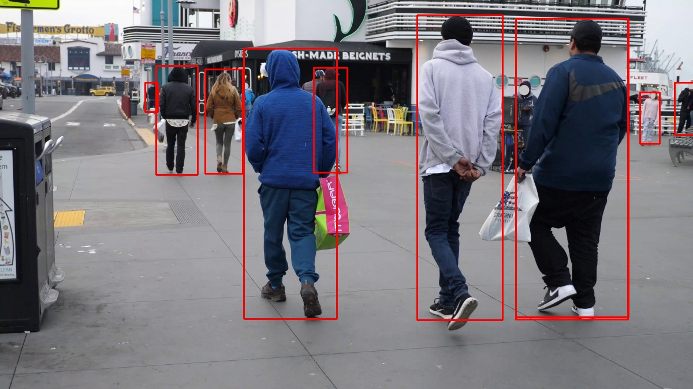

# How to Change TLT PeopleNet to TensorRT type & Run on Jetson(Nano) in Python

## Documents

### PeopleNet NVidia Address

https://ngc.nvidia.com/catalog/models/nvidia:tlt_peoplenet

### PeopleNet TLT Model Download Address

https://ngc.nvidia.com/catalog/models/nvidia:tlt_peoplenet/files?version=pruned_v2.0


### Environments & Tools 

* A Jetson Hardware(Nano,TX2,TX1,Jetson AGX Xavier,Jetson Xavier NX)

* Jetpack(On Jetson Hardware,you should have installed a jetpack which version is V4.3 or V4.4 or V4.4.1)

* tlt-converter(Depending on different versions of Jetpack)

## Steps

### 1. Download 

* Download PeopleNet model 

[PeopleNet Model Address](https://ngc.nvidia.com/catalog/models/nvidia:tlt_peoplenet/files?version=pruned_v2.0)

* Download tlt-converter in Jetson platform

[tlt-converter in Jetson Platform Address](https://forums.developer.nvidia.com/t/nvidia-transfer-learning-toolkit-tlt-converter-for-tensorrt-6/122941/13)

```txt
If you run tlt-converter in Jetson platform, we support three kinds of tlt-converter.
https://developer.nvidia.com/tlt-converter-trt51
https://developer.nvidia.com/tlt-converter-trt60 4
https://developer.nvidia.com/tlt-converter-trt71 4
```


### 2. Use tlt-converter change TLT-type(.etlt) to TensorRT-type

```shell
./tlt-converter resnet34_peoplenet_pruned.etlt -k tlt_encode -d 3,544,960 -t fp1
```

### 3. Use TensorRT to Inference

```shell
cd sources
./main.py
```

After you execute the main.py, you will get a output image as below.


### Input Image & Output Image

#### Input Image


#### Output Image




***If this is useful for you,please star me.***
